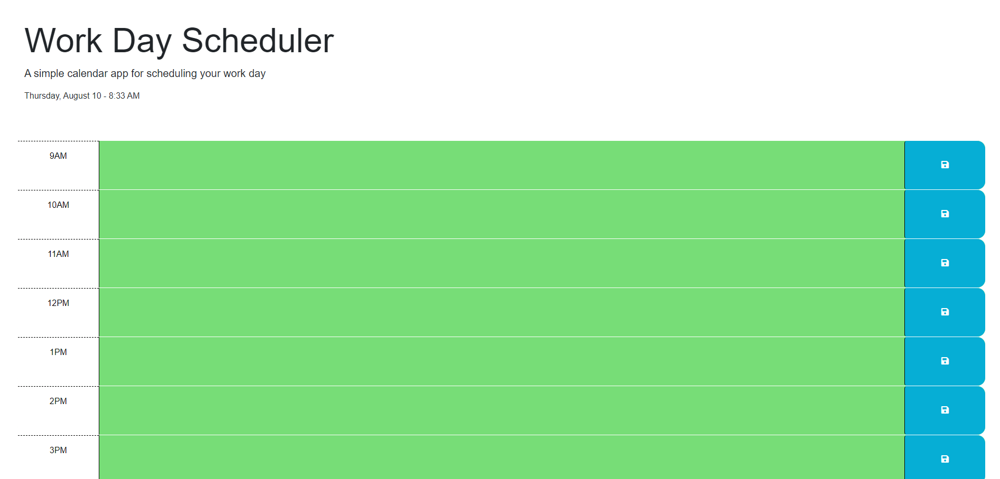
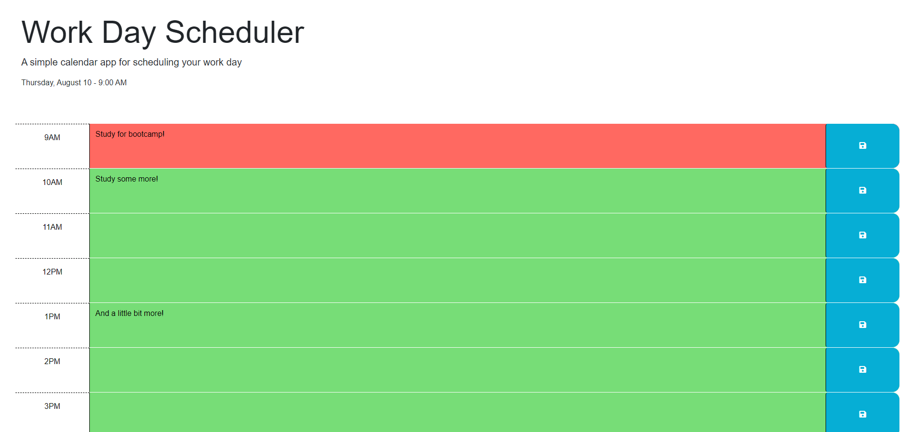
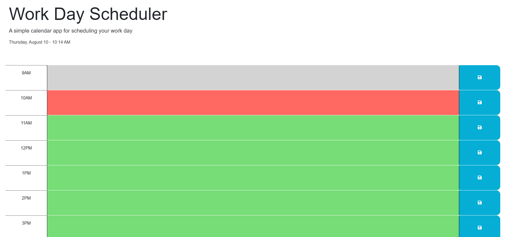

# Module 5 Project

## Description

This a code quiz project as a part of week 5 assignments for the UofT Flex Bootcamp.

## Installation

N/A

## Usage

Please visit following link to see final results

https://wesleyhas.github.io/daily-planner-project/

Select a time of the day, type what activity you want to save and click on save. It will stay on the page even if you refresh the page. Once local storage is cleared, the planner is cleaned.

## Preview of Page

## Credits

Credits to Xandromus for the original mock-up.

https://github.com/coding-boot-camp/crispy-octo-meme

## License

Please refer to the LICENSE in the repo.